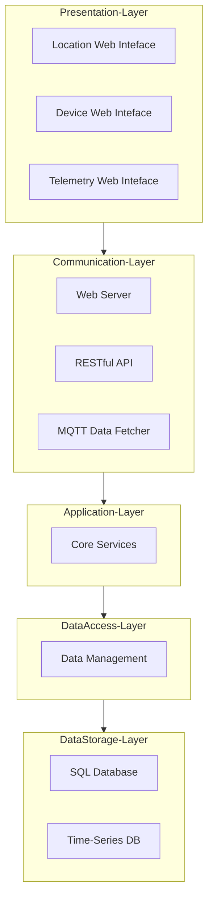
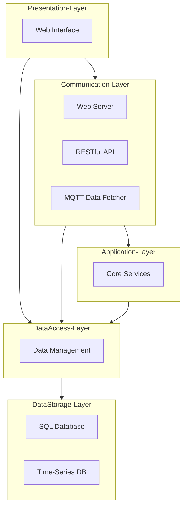
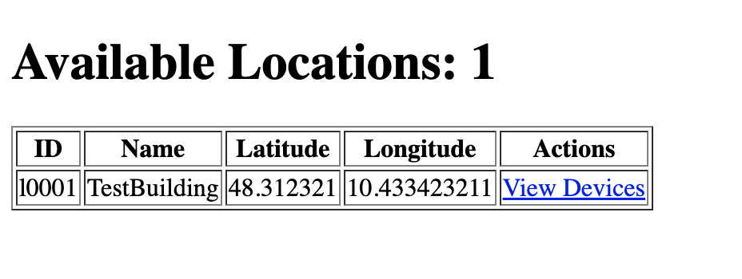
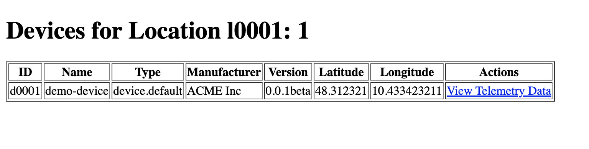
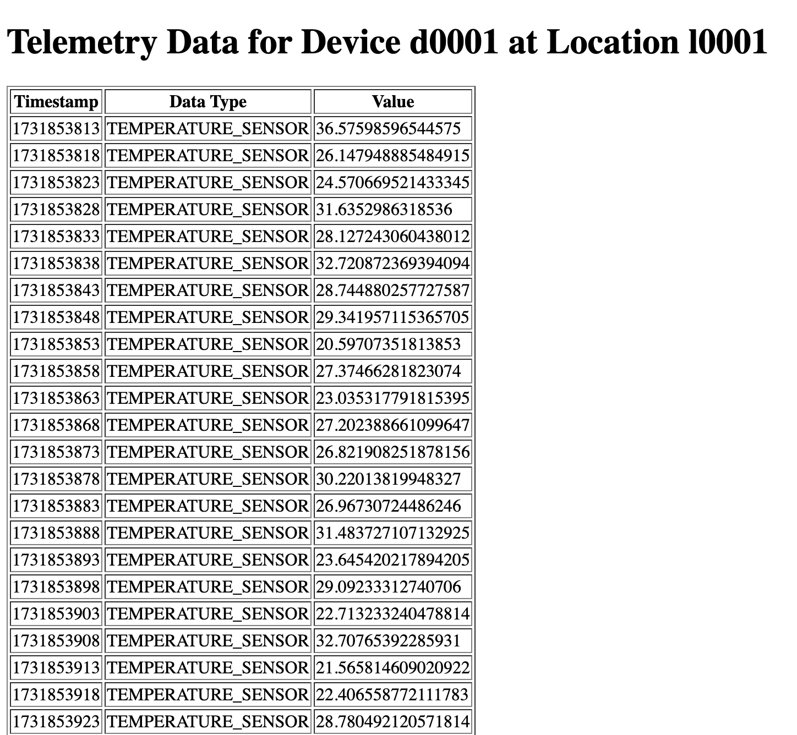

# IoT Monolithic Software Architecture Playground

This project is designed as an IoT Monolithic Software Architecture Playground, 
demonstrating a structured approach to building an IoT application using an 
**n-Tier** architecture. The architecture is divided into five distinct layers, 
each responsible for specific functionalities, ensuring modularity, 
scalability, and maintainability.

## n-Tier Architecture Overview

Designing an n-Tier Software Architecture for an Internet of Things (IoT) 
application involves separating concerns into different layers, each responsible for specific aspects of the system. 
Below is a proposed architecture that meets the specified requirements for the target Playground and Example:

The idea of the architecture (using the framework [https://mermaid.js.org/](https://mermaid.js.org/)) is the following: 

## System Architecture Description

The system architecture is structured into five distinct layers, each responsible for specific functionalities, 
ensuring a modular and scalable design for the Internet of Things (IoT) application. The layers are as follows:

### 1. Presentation Layer
- **Web Interface**: This component provides the user interface for the system, allowing users to interact with the application through a web browser. It displays device information, telemetry data, and other relevant details.

### 2. Communication Layer
- **Web Server**: Handles HTTP requests from the Web Interface and other clients. It serves static and dynamic content and manages incoming and outgoing web traffic.
- **RESTful API**: Exposes system functionalities and data through RESTful endpoints, allowing external applications to interact with the system programmatically.
- **MQTT Data Fetcher**: Manages MQTT communication, subscribing to MQTT topics to collect device information and telemetry data from various devices.

### 3. Application Layer
- **Core Services**: Implements the business logic of the application. It processes data received from the Communication Layer, executes core application functionalities, and manages the flow of information between different layers.

### 4. Data Access Layer
- **Data Management**: Provides an abstraction layer for data access. It handles CRUD operations (Create, Read, Update, Delete) and ensures data integrity and consistency when interacting with the underlying storage systems.

### 5. Data Storage Layer
- **SQL Database**: Stores structured data such as device inventory and configuration settings in a relational database.
- **Time-Series DB**: Stores time-series data, such as telemetry data from IoT devices, which is optimized for handling large volumes of time-stamped information.
- **Note**: In this example the Data Storage Layer is not implemented and the Data Access Layer interacts with the data directly through an in memory data structure.

This architecture ensures a clear separation of concerns, making the system modular, scalable, and easier to maintain. 
Each layer focuses on specific responsibilities, facilitating independent development, testing, and scaling of different parts of the system.

This example of an n-Tier architecture separates concerns into distinct layers, improving maintainability, scalability, and flexibility. 
Each layer can be developed, deployed, and scaled independently, allowing for a robust and flexible IoT system.

## Decision to Implement a Closed Layer Approach

### Closed Layer Architecture

In a closed layer architecture, each layer can only interact with the layer directly below it. This ensures a clear separation of concerns and encapsulation, making the system modular and easier to maintain.

- **Presentation Layer** can only communicate with the **Communication Layer**.
- **Communication Layer** can only communicate with the **Application Layer**.
- **Application Layer** can only communicate with the **Data Access Layer**.
- **Data Access Layer** can only communicate with the **Data Storage Layer**.

This approach adheres to the principle of **layers of isolation**, which means:
- Changes in one layer do not affect other layers.
- Layers remain independent with well-defined interfaces.
- Each layer has minimal knowledge of the inner workings of other layers.

#### Advantages of Closed Layer Architecture

- **Encapsulation**: Each layer is isolated, making it easier to manage and update.
- **Maintainability**: Changes in one layer do not cascade to others, reducing the risk of introducing bugs.
- **Scalability**: Individual layers can be scaled independently based on load requirements.

#### An Example of Open Layer Architecture

In an open layer architecture, any layer can bypass intermediate
layers to directly interact with a lower layer. 
For instance, the Presentation Layer 
can directly access the Data Access Layer without going through the Application Layer.

##### Potential Issues with Open Layer Architecture
 
- Tight Coupling: Layers become tightly coupled, making the system more brittle and harder to maintain.
- Increased Complexity: Direct interactions between non-adjacent layers can introduce complex dependencies.
- Difficult to Isolate: Changes in one layer can have cascading effects on multiple layers, making it difficult to isolate and fix issues.

Example of the same architecture with an open layer approach:

The choice between open and closed layers depends on the specific needs 
of the application. 
Closed layers provide better encapsulation and maintainability, 
while open layers offer flexibility at the cost of 
increased complexity and tighter coupling. For most applications, 
especially those requiring high maintainability 
and scalability, a closed layer architecture is preferred.

## File Structure Overview

The project is structured into different directories, each representing a specific layer of the n-Tier architecture.
The main folders and files of the project are as follows:

- `presentation`: Contains the web interface components for the system
- `communication`: Includes the web server, RESTful API, and MQTT data fetcher
- `application`: Contains the core services of the application
- `data`: Manages data access and interactions with the storage systems
- `config`: Stores configuration files for the system
- `test`: Includes test scripts for different components of the system to interact with the layers
- `main.py`: Entry point of the application, orchestrating the interactions between different layers

### Presentation Layer

The `presentation` directory contains the web interface components, including HTML, CSS, and JavaScript files for the user interface.
Involved files at the moment are just simple HTML files, but in a real-world scenario, this directory would contain more complex web application files.
Included files are:

- `locations.html`: Displays registered device locations
- `devices.html`: Lists registered devices and their details associated to a target location
- `telemetry.html`: Shows telemetry data for a selected device

### Communication Layer

The `communication` directory includes the web server, RESTful API, and MQTT data fetcher components.
These components handle incoming requests, expose system functionalities, and collect data from IoT devices.
The files in this directory are:

This layer is composed by the following sub modules (and the associated folders):

- `web`: Contains the web server implementation using Flask
  - `web_server.py`: Implements the web server using Flask and renders the web interface of the presentation layer
- `api`: Implements the RESTful API endpoints for the system using Flask-RESTful
  - `restful_api_server.py`: Defines the RESTful API endpoints for the system
  - `resources`: Contains the resources for the RESTful API endpoints
  - `dto`: Contains the Data Transfer Objects (DTOs) for the API
- `mqtt`: Manages MQTT communication and data fetching using the Paho MQTT library
  - `mqtt_data_fetcher.py`: Subscribes to MQTT topics and fetches telemetry data from IoT devices
  - `dto`: Contains the Data Transfer Objects (DTOs) for MQTT data

## Testing 

In order to test the application you can run the `main.py` file that run the application activating 
each layer of the architecture and run in parallel the different modules as independent threads.

Once the application is running you can access the web interface by opening a web browser and navigating to the following URLs:

- [http://localhost:7071/locations](http://localhost:7071/locations): Displays registered device locations
- [http://localhost:7071/devices](http://localhost:7071/devices): Lists registered devices and their details associated with a target location
- [http://localhost:7071/telemetry](http://localhost:7071/telemetry): Shows telemetry data for a selected device

To simulate the data fetching from IoT devices, you can publish messages to the MQTT broker as an already registered device
`d0001` using the script `test/mqtt/json_producer_default_device.py`.

If you want to create additional devices or locations you can have a look at the following test scripts:

- `test/http/create_location.py`: Creates a new location using the RESTful API
- `test/http/create_device_1.py`: Creates a new device using the RESTful API
- `test/mqtt/json_producer_device_1.py`: Publishes telemetry data for an existing device

Example of the Web Interface and Presentation Layer are the following:

**Location List** available at [http://localhost:7071/locations](http://localhost:7071/locations)

**Device List** available at [http://localhost:7071/devices](http://localhost:7071/devices)

**Telemetry Data List** available at [http://localhost:7071/telemetry](http://localhost:7071/telemetry)

