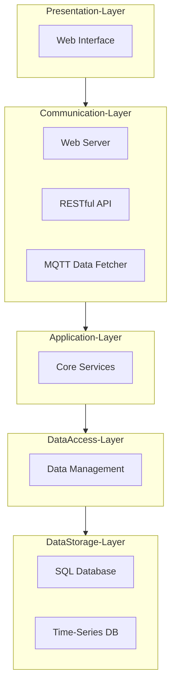

# IoT Monolithic Software Architecture Playground

This project is associated to the IoT Monolithic Software Architecture Laboratory.....

## n-Tier Architecture Overview

Designing an n-Tier Software Architecture for an Internet of Things (IoT) 
application involves separating concerns into different layers, each responsible for specific aspects of the system. 
Below is a proposed architecture that meets the specified requirements for the target Playground and Example:

The idea of the architecture (using the framework [https://mermaid.js.org/](https://mermaid.js.org/)) is the following: 

# System Architecture Description

The system architecture is structured into five distinct layers, each responsible for specific functionalities, ensuring a modular and scalable design for the Internet of Things (IoT) application. The layers are as follows:

## 1. Presentation Layer
- **Web Interface**: This component provides the user interface for the system, allowing users to interact with the application through a web browser. It displays device information, telemetry data, and other relevant details.

## 2. Communication Layer
- **Web Server**: Handles HTTP requests from the Web Interface and other clients. It serves static and dynamic content and manages incoming and outgoing web traffic.
- **RESTful API**: Exposes system functionalities and data through RESTful endpoints, allowing external applications to interact with the system programmatically.
- **MQTT Data Fetcher**: Manages MQTT communication, subscribing to MQTT topics to collect device information and telemetry data from various devices.

## 3. Application Layer
- **Core Services**: Implements the business logic of the application. It processes data received from the Communication Layer, executes core application functionalities, and manages the flow of information between different layers.

## 4. Data Access Layer
- **Data Management**: Provides an abstraction layer for data access. It handles CRUD operations (Create, Read, Update, Delete) and ensures data integrity and consistency when interacting with the underlying storage systems.

## 5. Data Storage Layer
- **SQL Database**: Stores structured data such as device inventory and configuration settings in a relational database.
- **Time-Series DB**: Stores time-series data, such as telemetry data from IoT devices, which is optimized for handling large volumes of time-stamped information.

## Data Flow

1. **Presentation Layer**: Users interact with the Web Interface to view and manage device information and telemetry data.
2. **Communication Layer**:
   - The Web Server processes HTTP requests from the Web Interface.
   - The RESTful API provides endpoints for accessing system functionalities and data.
   - The MQTT Data Fetcher collects data from IoT devices via MQTT protocol.
3. **Application Layer**: Core Services process the incoming data and perform necessary business logic operations.
4. **Data Access Layer**: Data Management handles the interaction with the storage systems, ensuring data is correctly saved and retrieved.
5. **Data Storage Layer**: Data is stored in the SQL Database and the Time-Series DB as appropriate.

This architecture ensures a clear separation of concerns, making the system modular, scalable, and easier to maintain. Each layer focuses on specific responsibilities, facilitating independent development, testing, and scaling of different parts of the system.

This example of an n-Tier architecture separates concerns into distinct layers, improving maintainability, scalability, and flexibility. 
Each layer can be developed, deployed, and scaled independently, allowing for a robust and flexible IoT system.