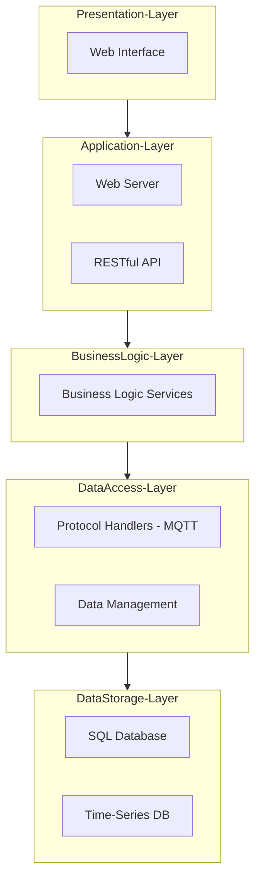

# IoT Monolithic Software Architecture Playground

This project is associated to the IoT Monolithic Software Architecture Laboratory.....

## n-Tier Architecture Overview

Designing an n-Tier Software Architecture for an Internet of Things (IoT) 
application involves separating concerns into different layers, each responsible for specific aspects of the system. 
Below is a proposed architecture that meets the specified requirements for the target Playground and Example:

The idea of the architecture (using the framework [https://mermaid.js.org/](https://mermaid.js.org/)) is the following: 



1. **Presentation Layer (Client Tier)**
    - Responsibilities:
      - Provide a user interface for interacting with the information and data of IoT devices. 
      - Display device information and telemetry data. 
      - Allow users to interact with the RESTful API
    - Components:
      - Web Interface (Frontend):
        - Technologies: HTML, CSS, JavaScript (React.js, Angular, or Vue.js)
        - Responsibilities: Display data, provide user controls, and handle user inputs.
2. **Application Layer (Web Server Tier)**
    - Responsibilities:
      - Serve the web interface to clients. 
      - Handle HTTP RESTful API requests.
      - Process business logic.
    - Components:
      - Web Server: 
        - Technologies: Node.js (Express.js), Django, or Flask
        - Responsibilities: Serve static content (web interface) and handle dynamic content (API requests).
      - RESTful API:
        - Technologies: Express.js (Node.js), Django REST Framework (Python), Spring Boot (Java)
        - Responsibilities: Provide endpoints for accessing device information and telemetry data.
3. **Business Logic Layer (Service Tier)**
    - Responsibilities:
      - Process data and apply business rules. 
      - Interface between the web server and data sources. 
    - Components:
      - Business Logic Services:
        - Technologies: Node.js, Python, Java 
        - Responsibilities: Implement business rules, data processing, and interaction with data access layer.
4. **Data Access Layer (Integration Tier)**
    - Responsibilities:
      - Interface with different data sources and protocols. 
      - Collect device information and telemetry data.
    - Components:
      - Protocol Handlers:
        - Technologies: MQTT.js (Node.js), Paho MQTT (Python), HiveMQ (Java)
    - Responsibilities: Collect data from devices using protocols like MQTT. 
      - Data Aggregators:
        - Responsibilities: Aggregate data from multiple protocol handlers and send it to the data storage layer.
5. **Data Storage Layer (Data Tier)**
   - Responsibilities:
     - Store device information and telemetry data.
     - Provide data access to the upper layers.
   - Components:
     - Database:
        - Technologies: PostgreSQL, MySQL, MongoDB
        - **In our simplified scenario both structured and unstructured data will be stored in memory.**
   - Responsibilities: Store structured device information (inventory) and unstructured telemetry data.
       - Time-Series Database (optional for telemetry):
       - Technologies: InfluxDB, TimescaleDB
       - Responsibilities: Efficiently store and query time-series telemetry data.

### Detailed Architecture Diagram

Below is a high-level architecture diagram outlining the components and their interactions:

```sql
 +-------------------------+
 |     Presentation Layer  |
 |-------------------------|
 |      Web Interface      |
 +-------------------------+
             |
             V
 +-------------------------+
 |     Application Layer   |
 |-------------------------|
 |       Web Server        |
 |      RESTful API        |
 +-------------------------+
             |
             V
 +-------------------------+
 |   Business Logic Layer  |
 |-------------------------|
 |  Business Logic Services|
 +-------------------------+
             |
             V
 +-------------------------+
 |   Data Access Layer     |
 |-------------------------|
 | Protocol Handlers (MQTT)|
 | Data Management         |
 +-------------------------+
             |
             V
 +-------------------------+
 |     Data Storage Layer  |
 |-------------------------|
 |      SQL Database       |
 |      Time-Series DB     |
 +-------------------------+
```

### Workflow

1. Device Information Collection:
   - Protocol handlers connect to devices using protocols like MQTT.
   - Data aggregators collect and format the data for storage.
   - The formatted data is stored in the relational database.
2. Device Data Collection (Telemetry):
   - Protocol handlers collect telemetry data from devices.
   - Data aggregators process and store telemetry data in the time-series database.
3. Data Exposure:
   - The RESTful API exposes device information and telemetry data to clients.
   - The web interface interacts with the RESTful API to display data to users.

This example of an n-Tier architecture separates concerns into distinct layers, improving maintainability, scalability, and flexibility. 
Each layer can be developed, deployed, and scaled independently, allowing for a robust and flexible IoT system.